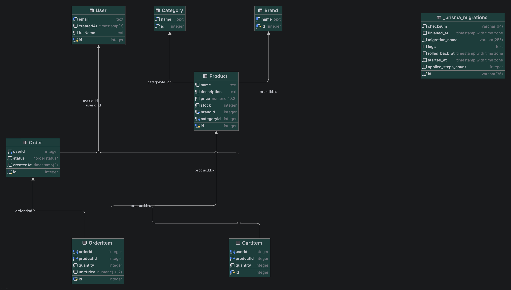

## Author: Nguyen Thi Hang Ly
## Live demo
[Link] https://web-backend-bfmc.onrender.com

## Project scope
This project implements a multi-page MVC web app with NestJS, EJS templates, Prisma ORM and PostgreSQL.
- **Lab 1**: Render deployment, static frontend serving, EJS template partials/layout.
- **Lab 2**: Domain model with relational schema + Prisma migrations + ER diagram.
- **Lab 3**: Subdomain modules, server-side CRUD pages, service-layer business logic, and SSE realtime updates.

## Domain model
Main entities:
- User
- Brand
- Category
- Product
- Order
- OrderItem
- CartItem

Relations are defined in `prisma/schema.prisma` and visualized in ERD:

Required variables:
- `PORT`: application port (Render provides this automatically)
- `SESSION_SECRET`: secret for session cookie signing
- `DATABASE_URL`: PostgreSQL connection string

# Install
## development
$ npm run start

## watch mode
$ npm run start:dev

## production mode
$ npm run start:prod

## database setup
$ npx prisma generate

$ npx prisma migrate dev --name init